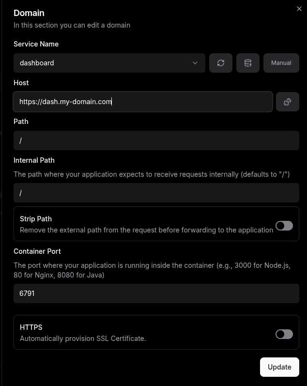

## Convex

Self Hosting convex on Dokploy is as east as below:

1. Download the compose file from this [url](https://github.com/get-convex/convex-backend/tree/main/self-hosted/docker/docker-compose.yml)
2. On the `Environment` tab add the urls as below:
```yaml
# URL of the Convex API as accessed by the client/frontend.
CONVEX_CLOUD_ORIGIN='https://api.my-domain.com'
# URL of Convex HTTP actions as accessed by the client/frontend.
CONVEX_SITE_ORIGIN='https://my-domain.com'
# URL of the Convex API as accessed by the dashboard (browser).
NEXT_PUBLIC_DEPLOYMENT_URL='https://dash.my-domain.com'
```
3. Run deploy on the dokploy `General` tab.
4.  Once the deployment is complete go to the domains tab and add the `NEXT_PUBLIC_DEPLOYMENT_URL='https://dash.my-domain.com'` as below:


    and the `CONVEX_CLOUD_ORIGIN='https://api.my-domain.com'` as below:


5. On the okploy `General` tab run reload to populate the deployment urls. 
6. SSH into your VPS and identify the backend docker container and run the following commands:
```bash
docker exec -it [your-backend-container-name] sh
# then
./generate_admin_key.sh
```
copy the full key including the `convex-self-hosted|` part and go to the dns dash.my-domain.com and add the api dns to the deployment url and the key we just generated to the password and click login. 

7. Generate any project and add the following to a `env.local`:

```sh
CONVEX_SELF_HOSTED_URL='https://api.my-domain.com'
CONVEX_SELF_HOSTED_ADMIN_KEY='<your admin key>'
```
and run `npx convex dev`

and thats it :)! youve setup a project with convex selfhosted


